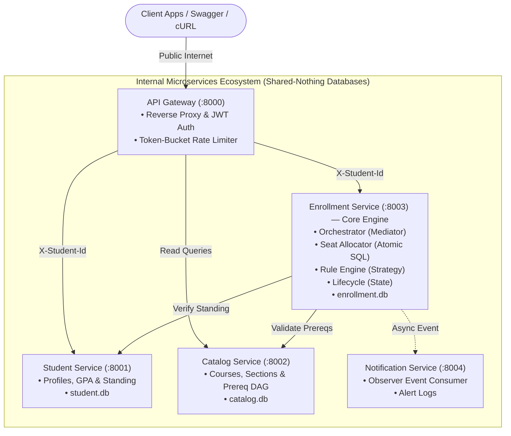

# Student Course Registration System (Next-Gen Microservices)

> **Course**: 13016228 Software Design and Architecture (KMITL)  
> **Tech Stack**: Python 3.11+ / FastAPI / Async SQLAlchemy / Pydantic v2 / HTTPX / PyJWT  
> **Package & Toolchain Manager**: **Astral `uv`**  

---

## 1. System Architecture & Port Allocation

The system consists of 4 decoupled domain microservices fronted by a centralized API Gateway (Protection Proxy):



### Port Matrix

| Service | Port | Database | Primary Responsibility |
|---|---|---|---|
| **API Gateway** | `8000` | Stateless | Ingress reverse proxy, JWT authentication (`/auth/login`), Protection Proxy rate-limiting. |
| **Student Service** | `8001` | `student.db` | Student profiles, GPA, financial holds, academic standing, credential verification. |
| **Catalog Service** | `8002` | `catalog.db` | Course offerings, sections, quotas, graph-based prerequisite traversal (DAG). |
| **Enrollment Service** | `8003` | `enrollment.db` | Core registration engine: atomic seat reservations, validation strategy, waitlist FIFO. |
| **Notification Service** | `8004` | Append-Only | Observer event subscriber; asynchronous dispatch of enrollment/waitlist alerts. |

---

## 2. Quickstart for Team Members (One-Time Setup)

### Step 1: Install Dependencies & Setup Virtualenv
We use **Astral `uv`** for blazing fast, deterministic dependency management:
```powershell
# Installs all dependencies in milliseconds using uv.lock
uv sync
```

### Step 2: Verify Setup
Run the baseline automated health check tests:
```powershell
uv run pytest tests/ -v
```
All 5 microservice health checks should pass immediately!

---

## 3. How to Run Services Locally

You can launch each microservice in an independent terminal (with auto-reload on code change):

```powershell
# Terminal 1: API Gateway (Port 8000)
uv run uvicorn api_gateway.main:app --port 8000 --reload

# Terminal 2: Student Profile Service (Port 8001)
uv run uvicorn student_service.main:app --port 8001 --reload

# Terminal 3: Course Catalog Service (Port 8002)
uv run uvicorn catalog_service.main:app --port 8002 --reload

# Terminal 4: Enrollment Service (Port 8003)
uv run uvicorn enrollment_service.main:app --port 8003 --reload

# Terminal 5: Notification Service (Port 8004)
uv run uvicorn notification_service.main:app --port 8004 --reload
```

Interactive Swagger documentation is instantly accessible:
* **Gateway**: `http://localhost:8000/docs`
* **Student Service**: `http://localhost:8001/docs`
* **Catalog Service**: `http://localhost:8002/docs`
* **Enrollment Service**: `http://localhost:8003/docs`
* **Notification Service**: `http://localhost:8004/docs`

---

## 4. Team Task Breakdown & Assignment Guide (3 Backend Engineers)

To allow the 3 teammates to work in parallel without merge conflicts, tasks are separated along clear architectural boundaries:

### Teammate 1: API Gateway, Security & Student Profile Service
*Components: `api_gateway/` & `student_service/`*
- [ ] Implement `api_gateway/auth.py` (`POST /api/v1/auth/login` issuing JWTs via `common.auth`).
- [ ] Implement `api_gateway/rate_limiter.py` (**Protection Proxy** token bucket rate limiter).
- [ ] Implement reverse proxy routing in `api_gateway/main.py` (injecting verified `X-Student-Id` header downstream).
- [ ] Implement `student_service/database.py` (async SQLite connection for `student.db`).
- [ ] Implement `student_service/models.py` (SQLAlchemy `Student` model: GPA, standing, hold, completed courses, password hash).
- [ ] Implement endpoints in `student_service/main.py`:
  - `GET /students/{id}`
  - `GET /students/{id}/eligibility`
  - `POST /students/verify-credentials`

### Teammate 2: Course Catalog, Prerequisite DAG & Notification Service
*Components: `catalog_service/` & `notification_service/`*
- [x] Implement `catalog_service/database.py` (async SQLite connection for `catalog.db`).
- [x] Implement `catalog_service/models.py` (SQLAlchemy `Course` and `Section` models).
- [x] Implement `catalog_service/prereq_dag.py` (Prerequisite Directed Acyclic Graph traversal & cycle detection).
- [x] Implement endpoints in `catalog_service/main.py`:
  - `GET /courses` & `GET /sections`
  - `POST /validate-prereqs`
- [ ] Implement `notification_service/database.py` & `models.py` (notification/alert log store).
- [ ] Implement `notification_service/event_consumer.py` (**Observer Pattern** subscriber for enrollment & waitlist events).
- [ ] Implement endpoints in `notification_service/main.py` (`POST /events`, `GET /notifications/{student_id}`).

### Teammate 3: Enrollment Core Engine & Concurrency Stress Testing
*Components: `enrollment_service/` & `tests/`*
- [ ] Implement `enrollment_service/database.py` & `models.py` (`Enrollment`, `Section`, `WaitlistOffer`).
- [ ] Implement `enrollment_service/seat_allocator.py` (Atomic SQL zero-overbooking conditional update).
- [ ] Implement `enrollment_service/validation.py` (**Strategy Pattern** for pluggable validation rules).
- [ ] Implement `enrollment_service/orchestrator.py` (**Mediator Pattern** coordinating with Student & Catalog).
- [ ] Implement `enrollment_service/state_machine.py` (**State Pattern** for enrollment lifecycle).
- [ ] Implement `enrollment_service/waitlist.py` (FIFO promotion & atomic conditional claiming).
- [ ] Expose endpoints in `enrollment_service/main.py`:
  - `POST /enrollments`
  - `POST /drops`
  - `POST /waitlist/claim`
- [ ] Implement `tests/test_concurrency_stress.py` (100 concurrent requests stress test with in-memory pre-minted tokens to prove zero overbooking).

---

## 5. Design Patterns Mapping (For Course Defense)

| Design Pattern | Location | Architectural Purpose |
|---|---|---|
| **Strategy Pattern** | `enrollment_service/validation.py` | Pluggable rule validators (`PrerequisiteRule`, `CreditCapRule`, `FinancialHoldRule`). |
| **Mediator Pattern** | `enrollment_service/orchestrator.py` | Coordinates cross-service queries between Student, Catalog, and Enrollment. |
| **State Pattern** | `enrollment_service/state_machine.py` | Governs the student registration state transitions (`STAGED -> OFFERED -> ENROLLED -> DROPPED`). |
| **Protection Proxy** | `api_gateway/rate_limiter.py` & `api_gateway/auth.py` | Centralized JWT auth verification & token bucket rate-limiting against button spam. |
| **Observer Pattern** | `notification_service/event_consumer.py` | Event-driven notification dispatching upon enrollment confirmations and waitlist offers. |

---

## 6. Code Quality & Standards

Before committing code or opening a pull request, run the following:

```powershell
# 1. Check linting and code style
uv run ruff check .

# 2. Automatically fix formatting and style issues
uv run ruff check --fix .

# 3. Run all automated tests
uv run pytest -v
```
