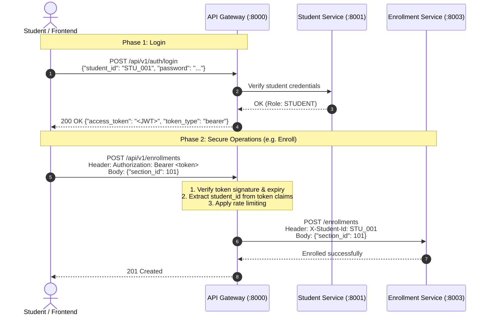

# Technology Stack & Implementation Guide
## Next-Gen Student Course Registration System (Project II)

> **Audience**: Team Implementation & Technical Defense  
> **Course**: 13016228 Software Design and Architecture (KMITL)  
> **Tech Stack**: Python 3.11+ / FastAPI / Async SQLAlchemy / Pydantic v2 / HTTPX  
> **Package & Environment Manager**: **Astral `uv`**  

---

## 1. Tech Stack Selection & Architectural Rationale

To build 4 decoupled microservices within a tight semester timeline while maintaining academic rigor:

| Layer | Technology | Architectural Rationale |
|---|---|---|
| **Language & Runtime** | **Python 3.11+** | High developer velocity, rapid prototyping, clean syntax, native asynchronous event loop (`asyncio`). |
| **Package & Env Manager** | **Astral `uv`** | Blazing-fast Rust-based package manager. Replaces pip, poetry, and virtualenv; uses `pyproject.toml` and deterministic `uv.lock`. |
| **Web Framework** | **FastAPI + Uvicorn** | Built on ASGI / Starlette; provides ultra-fast async request handling and auto-generated interactive OpenAPI documentation (`/docs`). |
| **Data Validation & DTOs** | **Pydantic v2** | High-performance C-core validation; strictly types domain DTOs, request payloads, and response serialization. |
| **Database & ORM** | **SQLAlchemy 2.0 (Async)** | Full control over ACID transaction boundaries (`async with session.begin():`) with native support for raw atomic conditional SQL updates. |
| **Inter-Service Communication** | **HTTPX (Async)** | Non-blocking HTTP client allowing the Orchestrator to query upstream services in parallel using `asyncio.gather()`. |
| **Authentication & Security** | **PyJWT** | Stateless, cryptographically signed JSON Web Tokens (HMAC-SHA256) verified at API Gateway. |
| **Testing & Concurrency** | **pytest + pytest-asyncio** | High-speed unit and integration testing; simulates 100+ concurrent student requests in a single script. |

### Why `uv` for our Monorepo?
1. **10–100x Faster than Pip**: Virtual environments and package installations resolve in milliseconds.
2. **Deterministic `uv.lock`**: Guarantees that every teammate and the demonstration environment run the exact same dependency versions without conflicts.
3. **Seamless Running (`uv run`)**: Automatically manages the virtual environment on the fly. You run `uv run uvicorn ...` without needing to manually activate virtual environments.

---

## 2. Monorepo Project Directory Structure

```text
student-registration-system/
├── pyproject.toml                  # Root dependency definitions (managed via uv)
├── uv.lock                         # Deterministic lockfile (ensures identical versions for all teammates)
├── docker-compose.yml              # Spins up all 4 microservices + Gateway
├── README.md
│
├── common/                         # Shared Pydantic DTOs & Event schemas
│   ├── __init__.py
│   ├── schemas.py                  # StudentDTO, CourseDTO, EnrollmentRequest, LoginRequest
│   ├── auth.py                     # JWT token signing & verification utilities
│   └── events.py                   # EnrollmentConfirmedEvent, WaitlistSlotOfferedEvent
│
├── api_gateway/                    # Port 8000 (FastAPI Reverse Proxy & Rate Limiter)
│   ├── main.py
│   ├── auth.py                     # Authentication dependency & /auth/login handler
│   └── rate_limiter.py             # Protection Proxy Pattern (token bucket / IP throttle)
│
├── student_service/                # Port 8001 (Student Profile & Standing)
│   ├── main.py
│   ├── models.py                   # Student SQLAlchemy model
│   └── database.py
│
├── catalog_service/                # Port 8002 (Course Catalog & Prerequisite DAG)
│   ├── main.py
│   ├── models.py                   # Course, Section models
│   ├── prereq_dag.py               # Graph traversal engine
│   └── database.py
│
├── enrollment_service/             # Port 8003 (Core Registration Engine)
│   ├── main.py
│   ├── orchestrator.py             # Mediator Pattern (Cross-service coordinator)
│   ├── validation.py               # Strategy Pattern (Rule Validation Engine via abc.ABC)
│   ├── seat_allocator.py           # Atomic SQL update (rowsAffected 1 vs 0)
│   ├── state_machine.py            # State Pattern (Staged -> Offered -> Enrolled -> Dropped)
│   ├── waitlist.py                 # Waitlist Manager (Conditional claiming & sweep)
│   ├── models.py                   # Enrollment, WaitlistOffer, Section models
│   └── database.py
│
├── notification_service/           # Port 8004 (Asynchronous Alert Service)
│   ├── main.py
│   └── event_consumer.py           # Observer Pattern
│
└── tests/
    ├── test_validation_strategy.py # Unit tests for rule validation engine
    ├── test_state_machine.py       # Unit tests for enrollment lifecycle
    └── test_concurrency_stress.py  # 100 concurrent threads load test
```

### Root `pyproject.toml`
```toml
[project]
name = "student-registration-system"
version = "0.1.0"
description = "Microservices-Based Course Registration Platform"
readme = "README.md"
requires-python = ">=3.11"
dependencies = [
    "fastapi>=0.115.0",
    "uvicorn[standard]>=0.30.0",
    "sqlalchemy[asyncio]>=2.0.35",
    "aiosqlite>=0.20.0",
    "pydantic>=2.9.0",
    "httpx>=0.27.0",
]

[dependency-groups]
dev = [
    "pytest>=8.3.0",
    "pytest-asyncio>=0.24.0",
]
```

---

## 3. Implementing GoF Design Patterns with Formal Python OOP

To satisfy the academic evaluation criteria of Software Design & Architecture, all patterns are built using Python's `abc.ABC` and strict type hints:

### 3.1 Strategy Pattern: Pluggable Rule Validation
```python
from abc import ABC, abstractmethod
from typing import List
from pydantic import BaseModel


class ValidationResult(BaseModel):
    is_valid: bool
    error_message: str | None = None


class ValidationStrategy(ABC):
    @abstractmethod
    async def validate(self, student_id: str, section_id: int) -> ValidationResult:
        """Encapsulates a distinct validation algorithm."""
        pass


class PrerequisiteRule(ValidationStrategy):
    async def validate(self, student_id: str, section_id: int) -> ValidationResult:
        # Evaluates prerequisite DAG
        return ValidationResult(is_valid=True)


class CreditLimitRule(ValidationStrategy):
    async def validate(self, student_id: str, section_id: int) -> ValidationResult:
        # Enforces <= 22 credit ceiling
        return ValidationResult(is_valid=True)


class RuleValidationEngine:
    def __init__(self, strategies: List[ValidationStrategy]):
        self.strategies = strategies

    async def run_validations(
        self, student_id: str, section_id: int
    ) -> ValidationResult:
        for strategy in self.strategies:
            res = await strategy.validate(student_id, section_id)
            if not res.is_valid:
                return res
        return ValidationResult(is_valid=True)
```

---

### 3.2 Mediator Pattern: Service Orchestrator
```python
import asyncio
import httpx


class EnrollmentOrchestrator:
    def __init__(self, student_svc_url: str, catalog_svc_url: str):
        self.student_svc_url = student_svc_url
        self.catalog_svc_url = catalog_svc_url

    async def coordinate_enrollment(
        self, student_id: str, section_id: int, course_code: str
    ):
        async with httpx.AsyncClient() as client:
            # Step 1: Concurrently execute read-only checks
            student_task = client.get(
                f"{self.student_svc_url}/students/{student_id}/eligibility"
            )
            catalog_task = client.post(
                f"{self.catalog_svc_url}/validate-prereqs",
                json={"student_id": student_id, "course_code": course_code},
            )

            student_res, catalog_res = await asyncio.gather(student_task, catalog_task)

            if student_res.status_code != 200:
                return {
                    "status": "REJECTED",
                    "detail": "Student eligibility check failed",
                }
            if catalog_res.status_code != 200:
                return {
                    "status": "REJECTED",
                    "detail": "Prerequisite requirements not met",
                }

        # Step 2: Validations passed! Proceed to local ACID transaction
        return await self.execute_local_enrollment_transaction(student_id, section_id)
```

---

## 4. Atomic Concurrency Control & Database Transactions

### 4.1 Zero-Overbooking Seat Allocation in Async SQLAlchemy
```python
from sqlalchemy import text
from sqlalchemy.ext.asyncio import AsyncSession


async def attempt_seat_reservation(
    session: AsyncSession, section_id: int, student_id: str
):
    async with session.begin():
        # 1. Atomic row update with conditional check
        stmt = text("""
            UPDATE sections 
            SET enrolled_count = enrolled_count + 1 
            WHERE section_id = :sec_id 
              AND enrolled_count < capacity
        """)
        result = await session.execute(stmt, {"sec_id": section_id})

        # 2. Application branching based on rowsAffected
        if result.rowcount == 1:
            # Seat successfully secured! Insert enrollment record in the SAME transaction
            insert_stmt = text("""
                INSERT INTO enrollments (student_id, section_id, status, enrolled_at)
                VALUES (:s_id, :sec_id, 'ENROLLED', CURRENT_TIMESTAMP)
            """)
            await session.execute(
                insert_stmt, {"s_id": student_id, "sec_id": section_id}
            )
            return {"status": "ENROLLED", "message": "Successfully enrolled!"}

        else:
            # Section is full! Place in waitlist (handled in a separate transaction)
            return {
                "status": "WAITLISTED",
                "message": "Section full. Placed on waitlist.",
            }
```

---

### 4.2 Safe Waitlist Claiming (Preventing TOCTOU Race Conditions)
```python
async def claim_waitlist_offer(
    session: AsyncSession, offer_id: int, student_id: str, section_id: int
):
    async with session.begin():
        # Atomic conditional update prevents race with background sweeper and double-clicks
        stmt = text("""
            UPDATE waitlist_offers
            SET status = 'CLAIMED'
            WHERE id = :offer_id
              AND status = 'OFFERED'
              AND expires_at > CURRENT_TIMESTAMP
        """)
        result = await session.execute(stmt, {"offer_id": offer_id})

        if result.rowcount == 1:
            # Winner of the claim! Finalize enrollment
            await session.execute(
                text("""
                INSERT INTO enrollments (student_id, section_id, status, enrolled_at)
                VALUES (:s_id, :sec_id, 'ENROLLED', CURRENT_TIMESTAMP)
            """),
                {"s_id": student_id, "sec_id": section_id},
            )
            return {"status": "CLAIMED", "message": "Seat claimed! You are enrolled."}
        else:
            # Already claimed or expired
            return {
                "status": "EXPIRED_OR_ALREADY_CLAIMED",
                "message": "Offer is no longer valid.",
            }
```

---

## 5. Authentication, Security & Login Architecture (Centralized Gateway JWT Pattern)

### 5.1 Architectural Rationale (Protection Proxy Pattern)
In our microservice ecosystem, individual downstream services (`enrollment_service`, `catalog_service`, `student_service`) do not manage login sessions or duplicate cryptographic verification. Instead, the **API Gateway** acts as the centralized security boundary:

1. **Centralized Authentication (Login)**: Client sends credentials to `POST /api/v1/auth/login`. The Gateway validates credentials against the student database and returns a digitally signed JWT (`HS256`).
2. **Centralized Authorization (Token Verification)**: On protected endpoints, the Gateway verifies the token signature and expiration, extracts the student ID from the `sub` claim, and injects a trusted internal header `X-Student-Id` when proxying to internal services.
3. **Identity from Token, Not Body**: Students do not supply `student_id` in registration payloads. The server strictly binds actions to the authenticated JWT subject, preventing identity spoofing (IDOR).
4. **Internal Microservice Trust Boundary**: Downstream services operate within the private VPC/network and trust the `X-Student-Id` header injected by the Gateway, keeping inter-service requests fast with zero cryptographic overhead.



### 5.2 Zero-Bypass Testing Philosophy
Testing high-concurrency workloads often tempts developers into writing "bypass headers" (e.g., `X-Bypass-Auth`). In our architecture, **no bypass backdoors exist**:
* **Security Risk Eliminated**: Backdoors cannot accidentally leak into staging or production.
* **In-Memory Pre-Minted Test Tokens**: Because JWT is stateless, automated test suites (such as the 100-concurrency stress test) generate 100 cryptographically valid test tokens in memory in ~2ms using `create_access_token()`.
* **Authentic Pipeline Verification**: Concurrency tests hit the real API Gateway with real `Authorization: Bearer <token>` headers, ensuring the production security pipeline itself is load-tested under heavy concurrency.

---

## 6. Automated Concurrency Verification Script

This script verifies that under 100 simultaneous requests for a 10-seat section, exactly 10 succeed and 90 are waitlisted with zero overbooking:

```python
# tests/test_concurrency_stress.py
import pytest
import asyncio
import httpx
from common.auth import create_access_token


@pytest.mark.asyncio
async def test_concurrent_registration_zero_overbooking():
    GATEWAY_URL = "http://localhost:8000"
    SECTION_ID = 101
    TOTAL_STUDENTS = 100
    CAPACITY = 10

    # Mint 100 valid JWT test tokens in-memory (No security bypasses!)
    tokens = [create_access_token(f"STU_{i:03d}") for i in range(TOTAL_STUDENTS)]

    async with httpx.AsyncClient(base_url=GATEWAY_URL, timeout=30.0) as client:
        # Create 100 concurrent registration tasks with real Bearer tokens
        tasks = [
            client.post(
                "/api/v1/enrollments",
                json={"section_id": SECTION_ID},
                headers={"Authorization": f"Bearer {tokens[i]}"},
            )
            for i in range(TOTAL_STUDENTS)
        ]

        # Fire all 100 requests concurrently
        responses = await asyncio.gather(*tasks)

        enrolled = [
            r
            for r in responses
            if r.status_code == 201 and r.json().get("status") == "ENROLLED"
        ]
        waitlisted = [
            r
            for r in responses
            if r.status_code == 409 and r.json().get("status") == "WAITLISTED"
        ]

        # Invariant Assertions
        assert len(enrolled) == CAPACITY, (
            f"Expected {CAPACITY} enrolled, got {len(enrolled)}"
        )
        assert len(waitlisted) == TOTAL_STUDENTS - CAPACITY, (
            f"Expected {TOTAL_STUDENTS - CAPACITY} waitlisted"
        )
        print(
            f"\n[PASS] Exactly {len(enrolled)} enrolled and {len(waitlisted)} waitlisted. Zero overbooking!"
        )
```

---

## 7. How to Run Locally with `uv`

### 1. Synchronize Dependencies (One-Time Setup)
```bash
# uv will automatically download Python (if needed), create the virtualenv, and install all dependencies in milliseconds
uv sync
```

### 2. Start Microservices with `uv run`
Open separate terminals or run in parallel:
```bash
# Terminal 1: API Gateway
uv run uvicorn api_gateway.main:app --port 8000 --reload

# Terminal 2: Student Profile Service
uv run uvicorn student_service.main:app --port 8001 --reload

# Terminal 3: Course Catalog Service
uv run uvicorn catalog_service.main:app --port 8002 --reload

# Terminal 4: Enrollment Service
uv run uvicorn enrollment_service.main:app --port 8003 --reload

# Terminal 5: Notification Service
uv run uvicorn notification_service.main:app --port 8004 --reload
```

### 3. Run Automated Tests
```bash
# Run stress test and invariant verification
uv run pytest tests/test_concurrency_stress.py -v
```

### 4. Interactive Live Demo
* Open `http://localhost:8003/docs` in your browser.
* Test `/api/v1/enrollments` live in front of your professor using FastAPI's built-in Swagger UI!
