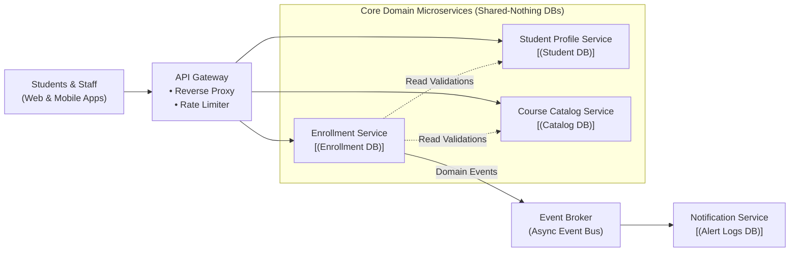
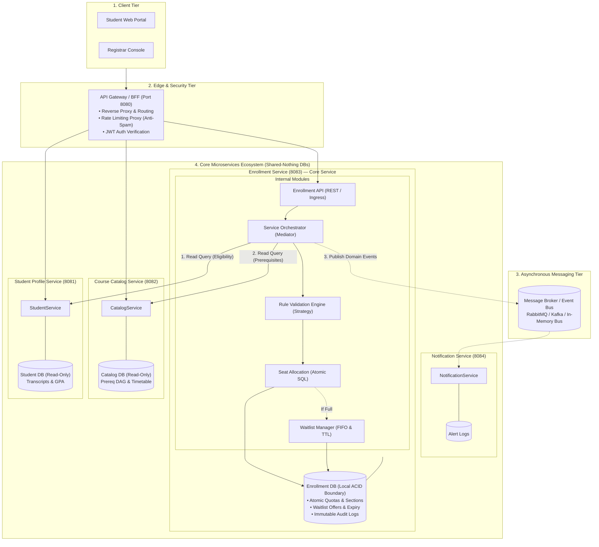

# System Architecture & Design Overview
## Next-Gen Student Course Registration System (Project II)

> **Audience**: Team Meeting & Architecture Walkthrough  
> **Course**: 13016228 Software Design and Architecture (KMITL)  
> **Topic**: Database-First Microservices Architecture, Orchestrated Service Aggregator & ACID Concurrency Control  

---

## 1. Executive Summary & The Problem We Are Solving

Every semester, thousands of university students experience the **"09:00:00 AM Registration Rush"**:
* Legacy registration systems choke under sudden registration opening bursts, causing **connection pool exhaustion, 500 error crashes, and locked database rows**.
* Uncoordinated multi-threading leads to **race conditions and phantom overbooking** (enrolling 43 students into a 40-seat room).
* Students face **frustrating post-checkout failures** (learning they lacked a prerequisite only *after* losing seats in alternate sections).

### Our Mission
Build a cloud-native, highly reliable **Microservices-Based Course Registration Platform** that guarantees:
1. **Zero Overbooking** under concurrent burst load.
2. **Sub-second responsiveness** through a hybrid pre-clearance validation model.
3. **Operational simplicity & sound engineering**: Encapsulating state changes within a clean local ACID transaction boundary, avoiding artificial distributed state stores and letting automated benchmarks verify performance.

---

## 2. High-Level Architecture Diagrams

### 2.1 Simplified High-Level Design (HLD)
*Use this clean, 30,000-foot view for quick slides, teammate intros, and executive summaries:*



---

### 2.2 Detailed Architecture & Component Topology
*Use this technical diagram to explain internal service modules, database boundaries, and API routes:*



---

## 3. The 4 Core Microservices Explained

| Service | Port | Bounded Context & Responsibility | Storage |
|---|---|---|---|
| **API Gateway** | `8080` | **Front door**: Rate limiting (prevents refresh spam at 09:00:00), routes requests, decodes student JWTs. | Stateless |
| **Student Profile Service** | `8081` | **Academic standing**: Cumulative GPA, student year, maximum credit ceiling ($\le 22$ credits), and academic probation flags. | Relational DB (Read-Only queries) |
| **Course Catalog Service** | `8082` | **Curriculum data**: Course offerings, sections, room times, instructors, and the **Prerequisite Graph (DAG)**. | Relational DB |
| **Enrollment Service** *(The Core)* | `8083` | **Core registration brain**: Houses the internal modules for orchestration, validation, atomic seat reservation, and waitlist management. | Relational DB (Single ACID Source of Truth) |
| **Notification Service** | `8084` | **Asynchronous messaging**: Consumes events from the broker to send emails and 24-hour waitlist claim alerts. | Append-Only Log DB |

### Internal Decomposition of `Enrollment Service`
```text
Enrollment Service
│
├── Enrollment API            # Handles HTTP REST endpoints (/enrollments, /drop, /waitlist)
├── Service Orchestrator      # Implements Mediator Pattern: coordinates read checks with other services
├── Rule Validation Engine    # Implements Strategy Pattern: validates term credits, timetable collisions
├── Seat Allocation           # Executes Atomic Conditional SQL update (zero-overbooking gatekeeper)
└── Waitlist Manager          # Manages FIFO queue and 24-hour time-limited claim window
```

---

## 4. Our 4 "Secret Sauces" (How We Solve the Hard Problems)

When explaining this design to the professor or classmates, highlight these four architectural decisions:

### 1. Zero Overbooking via Atomic Conditional SQL & Application Branching
* **The Problem**: If 100 students click "Enroll" at the exact same millisecond for 2 remaining seats, naive queries cause race conditions and overbooking.
* **Our Solution**: We execute an **Atomic Conditional SQL Update**:
  ```sql
  UPDATE sections 
  SET enrolled_count = enrolled_count + 1 
  WHERE section_id = :sectionId 
    AND enrolled_count < capacity;
  ```
  * **How it works**: Database engines automatically serialize row updates on `section_id`. 
  * **Application Branching**: Exactly **2 requests can successfully update the row (`rowsAffected = 1`)**, securing the seats. The remaining requests receive **`rowsAffected = 0`**, after which the `Enrollment Service` application code explicitly places them into the waitlist queue.
  * **Result**: 100% zero-overbooking guarantee backed by database ACID properties.

---

### 2. Hybrid Validation: Fast-Path + JIT Fallback
* **The Problem**: If thousands of students click "Enroll" simultaneously, checking prerequisites across services creates high inter-service query traffic.
* **Our Solution**: A two-track validation engine:
  1. **Fast-Path (Sub-Second Response)**: Students who planned their cart beforehand receive a pre-cleared, cryptographically signed token (or Academic Passport). At 09:00 AM, the Gateway verifies the token signature locally without making inter-service network calls, securing the seat immediately.
  2. **JIT Fallback**: If a student picks an unplanned course on the fly, the system doesn't block them! It gracefully executes a live Just-In-Time cross-service check before reserving the seat.

---

### 3. Orchestrated Service Aggregator with Local ACID Transaction Boundary
* **The Architectural Insight**: `Student Service` and `Catalog Service` only perform read-only validation queries. The only service that mutates state is the `Enrollment Service`.
* **How We Model It**: Instead of an artificial "Saga with fake compensations", we use the **Orchestrated Service Aggregator / GoF Mediator Pattern**:
  1. **Phase 1 (Read-Only Validations)**: Queries `Student Service` (standing & credit cap) and `Catalog Service` (prerequisite DAG). If either check fails, the request halts with HTTP 400. No state was changed, so nothing needs rollback!
  2. **Phase 2 (Local ACID Transaction Boundary)**:
     ```sql
     BEGIN;
       UPDATE sections SET enrolled_count = enrolled_count + 1 WHERE section_id = ? AND enrolled_count < capacity;
       INSERT INTO enrollments (student_id, section_id, status, enrolled_at) VALUES (?, ?, 'ENROLLED', NOW());
     COMMIT;
     ```
  3. **Guaranteed Rollback Safety**: If the `INSERT` or anything else fails, the database executes `ROLLBACK;`. The seat increment is undone automatically by the database engine. **Zero leaked seats, zero distributed compensation needed.**

---

### 4. User-Friendly Waitlist with Atomic Conditional Claiming
* **The Problem**: When a student has 24 hours to claim an open seat, what happens if they double-click the button, or if the background 24-hour expiration sweeper runs at the exact same millisecond?
* **Our Solution**: We make waitlist claiming **atomic and conditional**:
  ```sql
  BEGIN;
    UPDATE waitlist_offers
    SET status = 'CLAIMED'
    WHERE id = :offerId
      AND status = 'OFFERED'
      AND expires_at > NOW();

    -- If rowsAffected == 1:
    -- Proceed to create enrollment record and COMMIT.
    -- If rowsAffected == 0:
    -- ROLLBACK (Offer was already claimed by retry, or expired by the sweeper).
  COMMIT;
  ```
  * **Result**: Eliminates Time-of-Check to Time-of-Use (TOCTOU) race conditions. Double bookings during waitlist claims are mathematically impossible.

---

## 5. GoF Design Patterns Portfolio (Course Grading Alignment)

Our microservices natively demonstrate the Design Patterns taught in Lectures 1–10:

| Pattern | Where it Lives | What it Does in the System |
|---|---|---|
| **Mediator Pattern** | `Service Orchestrator` (Enrollment Service) | Centralizes and coordinates inter-service read validations before triggering the local enrollment transaction. |
| **Proxy Pattern** | API Gateway & Service Clients | Protection Proxy: Centralized JWT auth verification & rate-limiting against button spam; forwards verified `X-Student-Id` downstream. Caching proxy for catalog lookups. |
| **State Pattern** | Enrollment Lifecycle Model | Formally manages student enrollment lifecycle: `STAGED -> OFFERED -> ENROLLED -> WAITLISTED -> DROPPED`. |
| **Strategy Pattern** | `Rule Validation Engine` (Enrollment Service) | Pluggable rule algorithms (`PrerequisiteRule`, `TimeCollisionRule`, `CreditCapRule`) behind a common interface. |
| **Observer Pattern** | Event Bus & Notification Service | Decouples event emission (`SeatDropped`, `WaitlistSlotOffered`) from notification dispatching. |
| **Singleton Pattern** | `AcademicTermContext` | Stores global semester configurations and window timestamps. |

---

## 6. Talking Points for Your Team Discussion

1. **"Why Microservices instead of a Monolith?"**
   * *Answer*: During registration opening, write traffic is concentrated on the Enrollment Service, while Catalog receives massive read queries. Microservices allow us to independently scale the Enrollment Service and cache the Catalog, while isolating failures.
2. **"Why Database-First instead of Redis?"**
   * *Answer*: We avoid introducing an additional distributed state store. Seat allocation is protected by an atomic conditional database operation, and our stress test will measure throughput and latency under concurrent load.
3. **"Why Orchestrated Aggregator instead of a Saga?"**
   * *Answer*: Sagas are designed for distributed writes across multiple databases. In our registration flow, Student and Catalog checks are read-only. Wrapping the seat update and enrollment record in a single local ACID transaction boundary gives us instant, automatic database rollback without inventing fake distributed compensations.
4. **"How do we handle race conditions when claiming a waitlist seat?"**
   * *Answer*: We use a conditional atomic update on `waitlist_offers` with `status = 'OFFERED' AND expires_at > NOW()`. If the student claims at the exact same millisecond the 24-hour expiration sweeper runs, the database row lock guarantees that only one succeeds (`rowsAffected = 1`), eliminating duplicate claims or expired overrides.
5. **"How do we prove it works in our demo?"**
   * *Answer*: We let the benchmark prove the numbers. We will run an automated concurrency stress test with 100 concurrent threads competing for 10 seats, demonstrating that exactly 10 get enrolled, 90 get waitlisted, and zero overbooking occurs!
6. **"How does our system handle authentication and login across microservices?"**
   * *Answer*: We use Centralized Gateway Authentication (Protection Proxy). The API Gateway exposes `POST /api/v1/auth/login`, validates credentials against the student database, and issues a stateless JWT. When accessing protected routes like enrollment, the Gateway validates the JWT signature, extracts `student_id` directly from the token (preventing student identity tampering in request payloads), and passes a trusted `X-Student-Id` header to internal services. Internal microservices operate behind the gateway boundary without repeating cryptographic verification. Zero bypasses are used in testing—stress tests generate valid signed test tokens in-memory.
