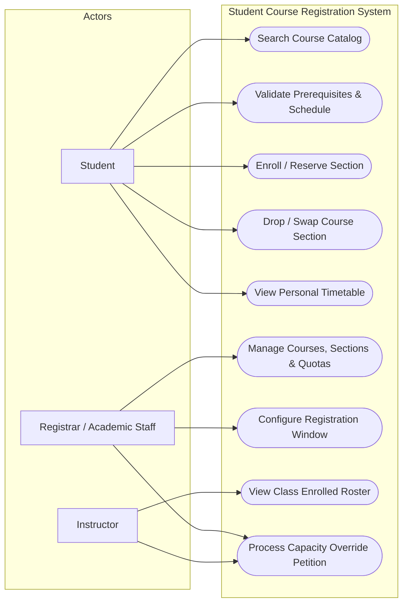
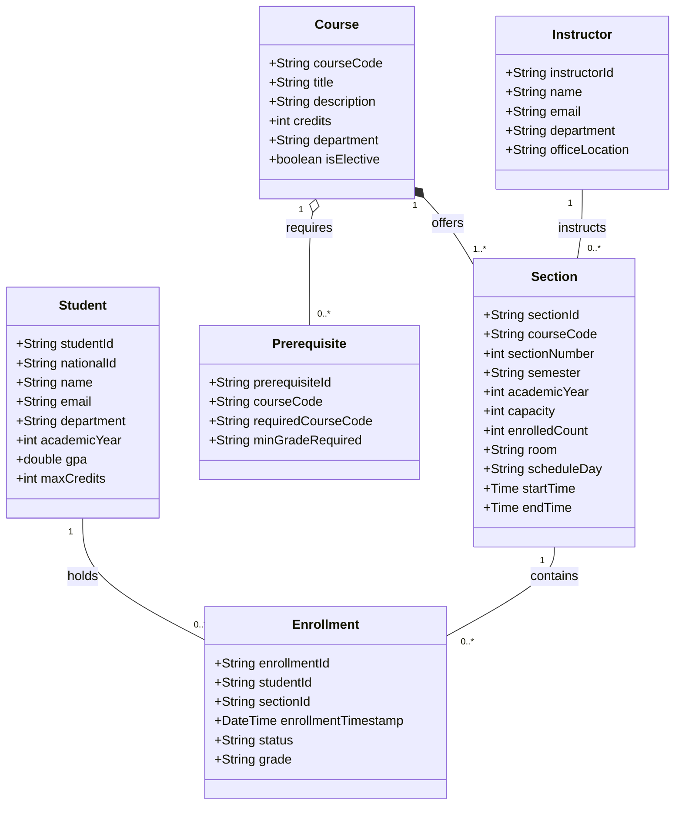
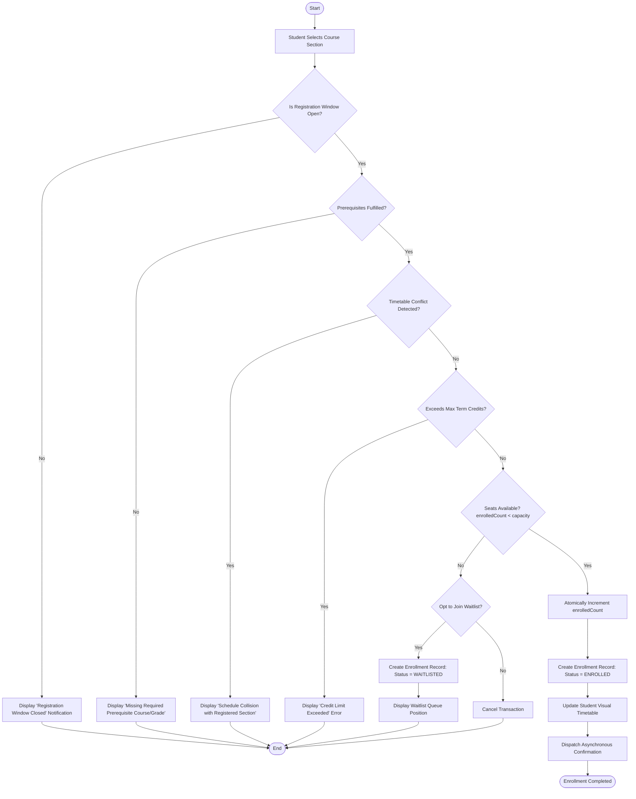

# Project Progress: Student Course Registration System (Project II)

**Course**: 13016228 Software Design and Architecture  
**Deliverable**: Project Progress — Problem Description and Requirement Model  
**Reference**: [9.4 GroupLab9.pdf](file:///C:/Users/USER/Documents/KMITL/Year%203/Software%20Design%20and%20Architecture/lect09/workspace/9.4%20GroupLab9.pdf)  

---

## 1. Problem Description

### 1.1 Narrative Overview & Problem Statement
Course registration in tertiary education institutions represents a classic high-contention, burst-traffic scenario. When registration windows open at scheduled hours (e.g., 09:00:00 AM), thousands of active students concurrently access the system to secure mandatory courses, prerequisite-locked subjects, and optimal class schedules.

Legacy registration architectures frequently suffer from severe failure modes:
1. **Concurrency Bottlenecks & Service Outages**: Synchronous locking at the database layer during simultaneous seat reservations leads to connection starvation, catastrophic cascading latency, and server downtime.
2. **Race Conditions & Phantom Bookings**: Inadequate isolation levels or uncoordinated multi-threaded reservations risk over-enrolling sections beyond physical classroom capacities or laboratory safety limits.
3. **Delayed Validation Feedback**: Students frequently experience late-stage transaction aborts caused by unfulfilled prerequisites, credit overload limits, or timetable collisions only *after* completing checkout, losing opportunities to register for alternate courses.
4. **Limited Operational Agility for Academic Administration**: Registrars and academic advisors lack real-time visibility into registration demand spikes, restricting their ability to dynamically expand section quotas or schedule supplemental lecture rooms.

To solve these challenges, this project designs and models an enterprise-grade **Student Course Registration System** engineered for high concurrency, atomic seat allocation, instantaneous client-side/server-side validation, and dynamic capacity management.

---

### 1.2 System Capabilities
The system provides the following core capabilities:
* **Interactive Catalog & Schedule Exploration**: Real-time querying of course offerings with dynamic multi-criteria filtering (department, academic level, time slot, instructor, seat availability).
* **Automated Prerequisite & Credit Limit Evaluation**: Instantaneous graph-based validation of prerequisites, minimum passing grades, and maximum allowed credit loads (e.g., maximum 22 credits per semester).
* **Timetable Conflict Detection**: Real-time calendar clash verification preventing students from enrolling in overlapping lecture or laboratory periods.
* **High-Throughput Atomic Seat Reservation**: Thread-safe reservation engine ensuring zero overbooking under peak concurrent loads.
* **Waitlist Management & FIFO Promotion**: Automatic waitlist placement when section capacities are reached, with event-triggered promotion upon seat release.
* **Administrative Quota & Section Control**: Live administrative console for registrars to adjust capacities, open new sections, schedule rooms, and audit enrollment histories.

---

### 1.3 Business Benefits
* **High Availability & Zero Peak Downtime**: Architectural resilience guarantees uninterrupted service during registration rushes.
* **100% Capacity & Safety Compliance**: Strict atomic consistency ensures section enrollments strictly respect room and lab capacities.
* **Drastic Reduction in Administrative Overhead**: Fully automated prerequisite and schedule conflict checking eliminates manual paperwork and ad-hoc registrar intervention.
* **Optimized Academic Resource Planning**: Real-time demand telemetry provides faculties with immediate data to scale section sizes and allocate instructional staff efficiently.

---

## 2. Requirement Model

### 2.1 Actors and Roles
* **Student**: Searches courses, validates schedules, reserves seats, drops/swaps courses, joins waitlists, and reviews personalized timetables.
* **Registrar / Academic Staff**: Configures academic terms, maintains course catalogs, manages sections and physical rooms, sets quotas, and manages override requests.
* **Instructor / Faculty Advisor**: Views class rosters, tracks enrollment numbers, and approves special prerequisite or capacity waiver petitions.
* **Notification Subsystem (External Service)**: Dispatches asynchronous enrollment confirmations, schedule change alerts, and waitlist promotion notices.

---

### 2.2 Use Case Diagram



---

### 2.3 Brief Use Case Descriptions

| Use Case ID | Use Case Name | Primary Actor | Description |
|---|---|---|---|
| **UC-01** | Search Course Catalog | Student, Staff | Queries course offerings by code, course name, department, time slot, instructor, and seat availability. |
| **UC-02** | Validate Prerequisites & Schedule | Student | Verifies academic prerequisites, minimum GPA requirements, and ensures no timetable conflicts exist. |
| **UC-03** | Enroll / Reserve Section | Student | Atomically secures an available seat in the designated section or enlists the student in the waitlist if full. |
| **UC-04** | Drop / Swap Course Section | Student | Cancels an existing enrollment, relinquishing the seat to trigger waitlist promotion, or swaps sections atomically. |
| **UC-05** | View Personal Timetable | Student | Renders a visual weekly calendar reflecting enrolled classes, venues, times, and total registered credits. |
| **UC-06** | Manage Courses & Quotas | Registrar | Creates, modifies, or deactivates courses, sections, quotas, instructors, and room assignments. |
| **UC-07** | Configure Registration Window | Registrar | Specifies start and end timestamps for registration tiers (e.g., 4th-year priority, general registration). |
| **UC-08** | View Class Enrolled Roster | Instructor | Displays registered students, grades, and attendance sheets for assigned course sections. |
| **UC-09** | Process Capacity Override Petition | Instructor, Registrar | Reviews and approves student waiver requests for closed or restricted courses. |

---

### 2.4 Domain Model & Object Classes

#### Object Classes (Types)
| Object Class | Attributes | Description |
|---|---|---|
| **Student** | `studentId`, `nationalId`, `name`, `email`, `department`, `academicYear`, `gpa`, `maxCredits` | Represents the student attempting registration. |
| **Course** | `courseCode`, `title`, `description`, `credits`, `department`, `isElective` | Master academic course definition. |
| **Prerequisite** | `prerequisiteId`, `courseCode`, `requiredCourseCode`, `minGradeRequired` | Defines dependency rules between courses. |
| **Section** | `sectionId`, `courseCode`, `sectionNumber`, `semester`, `academicYear`, `capacity`, `enrolledCount`, `room`, `scheduleDay`, `startTime`, `endTime` | Specific scheduled offering of a course. |
| **Enrollment** | `enrollmentId`, `studentId`, `sectionId`, `enrollmentTimestamp`, `status` (*ENROLLED, WAITLISTED, DROPPED*), `grade` | Association record capturing registration state. |
| **Instructor** | `instructorId`, `name`, `email`, `department`, `officeLocation` | Faculty member responsible for teaching sections. |

#### Domain Class Diagram



---

### 2.5 Activity Diagram (Workflow): "Enroll in Course Section"



---

### 2.6 User Interface Design

#### Course Catalog & Live Timetable Matrix (Student Portal)
```text
+-------------------------------------------------------------------------------------------------------------------------+
| [ KMITL LOGO ]   STUDENT COURSE REGISTRATION PORTAL                              Academic Year: 2026/1 | User: 65010042 |
+-------------------------------------------------------------------------------------------------------------------------+
| [Search Catalog]  |  [My Cart / Staging (2)]  |  [Registered Courses (15/22 cr)]  |  [Timetable View]  |  [Waitlist (1)] |
+-------------------------------------------------------------------------------------------------------------------------+
| FILTER & SEARCH:                                                                                                        |
| Department: [ Computer Engineering     v ]   Day: [ All Days v ]   Search: [ 01076228                        ] [SEARCH] |
+-------------------------------------------------------------------------------------------------------------------------+
| AVAILABLE SECTIONS:                                                                                                     |
| Code      Course Title                  Sec  Instructor     Time             Room    Seats  Status    Actions           |
| ----------------------------------------------------------------------------------------------------------------------- |
| 01076228  Software Design & Arch        1    Dr. Veera B.   Mon 09:00-12:00  HM402   48/50  OPEN      [ Enroll Now ]    |
| 01076228  Software Design & Arch        2    Dr. Veera B.   Mon 13:00-16:00  HM402   50/50  FULL      [ Join Waitlist ] |
| 01076230  Cloud Computing               1    Faculty Staff  Wed 09:00-12:00  ECC801  32/40  OPEN      [ Enroll Now ]    |
| 01076235  Distributed Systems           1    Faculty Staff  Tue 13:00-16:00  ECC704  25/30  OPEN      [ Enroll Now ]    |
+-------------------------------------------------------------------------------------------------------------------------+
| WEEKLY TIMETABLE PREVIEW:                                                                                               |
| Time         Monday                   Tuesday               Wednesday             Thursday             Friday           |
| ----------------------------------------------------------------------------------------------------------------------- |
| 09:00-12:00  [01076228 Sec 1 (OPEN)]                        [01076230 Sec 1 (OK)]                                       |
| 13:00-16:00                           [01076235 Sec 1 (OK)]                                                             |
+-------------------------------------------------------------------------------------------------------------------------+
| VALIDATION SUMMARY: Total Planned: 18 / Max: 22 Credits | Prereqs: MET | Clashes: NONE               [ CONFIRM PLAN ]   |
+-------------------------------------------------------------------------------------------------------------------------+
```

---

### 2.7 Non-Functional Requirements (Architecture Characteristics)

Following the software architecture principles covered in lectures 3–5:

1. **High Concurrency & Scalability**:
   * Must sustain peak request bursts up to **5,000 requests per second** at window opening without thread exhaustion or gateway timeout.
2. **Data Consistency & Isolation**:
   * Strict ACID transaction semantics or distributed locking ensures **zero overbooking** (i.e., `enrolledCount <= capacity` is an inviolable invariant).
3. **Low Latency & High Responsiveness**:
   * Search queries must respond within **$\le 100\text{ ms}$**.
   * Validation and atomic enrollment commit must complete within **$\le 350\text{ ms}$**.
4. **Fault Tolerance & Graceful Degradation**:
   * Failures in auxiliary components (e.g., email notification or audit logging) must not block or abort seat reservation transactions.
5. **Auditability & Traceability**:
   * Every transaction (attempt, enrollment, drop, waitlist move) must produce an immutable audit entry with timestamp, user ID, IP address, and transition state.
