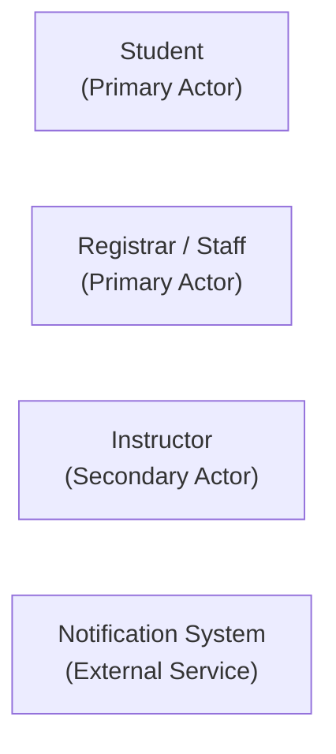
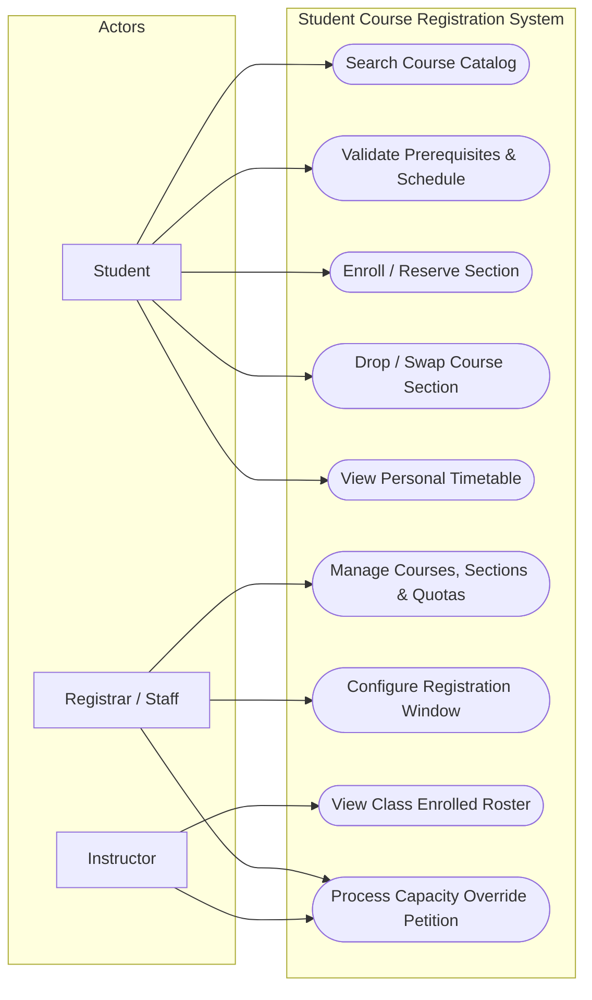
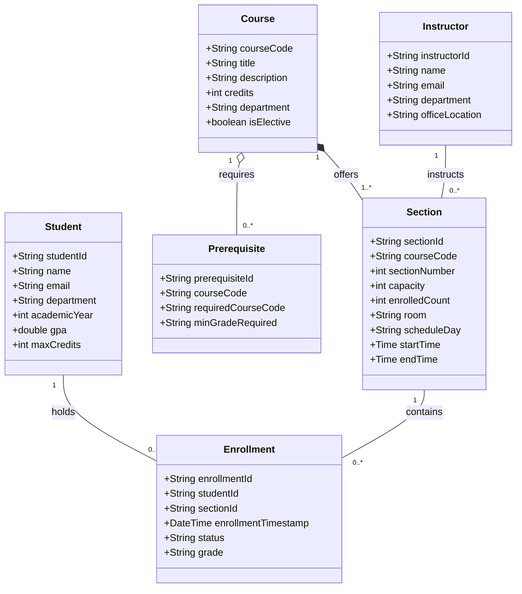
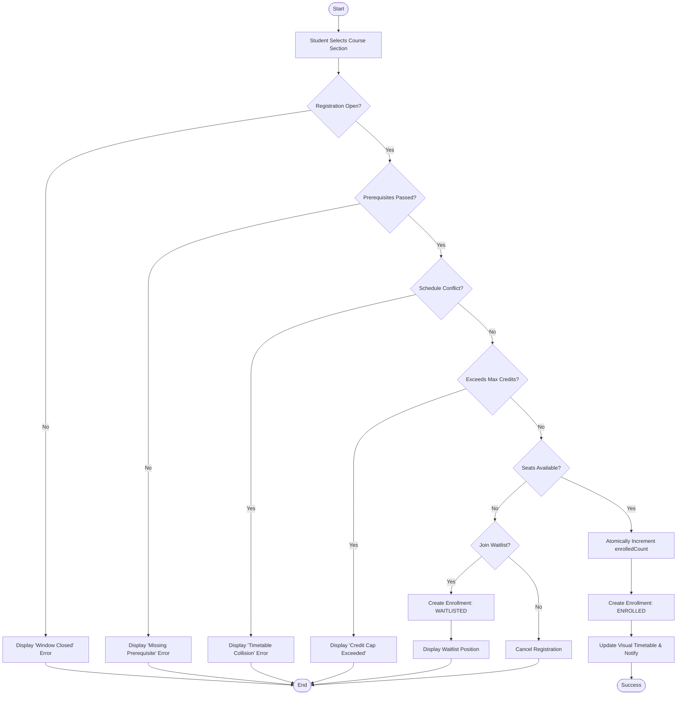

# Student Course Registration System
### High-Concurrency Academic Enrollment Platform
**Software Design and Architecture (13016228) — Project II Progress**

* **Deliverable**: Problem Description & Requirement Model
* **Reference**: Lecture 9 Project Progress Guidelines
* **Team Members**: [Insert Names / Student IDs]

---

## 1. Executive Summary & Problem Context

* **The Problem Scenario**: University registration windows exhibit extreme burst traffic at opening seconds (e.g., 09:00:00 AM).
* **Core Pain Points**:
  * **System Downtime**: Database connection pool starvation causes cascading crashes.
  * **Seat Race Conditions**: Concurrent seat allocations lead to accidental overbooking beyond physical classroom capacities.
  * **Delayed Validation**: Students discover prerequisite or schedule conflicts *after* submission, losing alternate class seats.
  * **Administrative Inflexibility**: Staff lack live demand telemetry to adjust quotas dynamically.

---

## 2. System Capabilities

* **Real-Time Course Catalog**: Multi-criteria search (department, time slot, instructor, seat availability).
* **Automated Prerequisite Engine**: Instantaneous graph-based checks for prerequisites, grades, and credit limits ($\le 22$ credits).
* **Timetable Conflict Detection**: Real-time validation preventing overlapping lecture/lab slots.
* **Atomic Seat Allocation**: Race-condition-free reservation engine with strict invariant enforcement (`enrolledCount <= capacity`).
* **Automated Waitlisting & Promotion**: First-Come, First-Served waitlist with automatic elevation upon student drop.
* **Registrar Management Console**: Live adjustments of section capacities, room assignments, and registration tiers.

---

## 3. Business Benefits

| Benefit Area | Impact & Metric |
|---|---|
| **System Reliability** | **Zero Downtime** during peak 09:00 AM burst traffic |
| **Capacity Safety** | **100% Quota Accuracy**; prevents classroom overcrowding |
| **Operational Efficiency** | **> 90% Reduction** in manual registrar petitions and paperwork |
| **Academic Resource Planning** | **Live Demand Analytics** enabling immediate section expansion |

---

## 4. System Actors & Roles



* **Student**: Plans timetable, enrolls/drops/swaps sections, monitors waitlist status.
* **Registrar / Academic Staff**: Defines courses, schedules sections, sets quotas, opens/closes windows.
* **Instructor**: Accesses class rosters, tracks enrolled students, approves special overrides.
* **Notification System**: Dispatches asynchronous confirmations and waitlist promotion alerts.

---

## 5. Use Case Diagram



---

## 6. Brief Use Case Descriptions

| ID | Use Case | Primary Actor | Description |
|---|---|---|---|
| **UC-01** | Search Course Catalog | Student, Staff | Query courses by code, title, instructor, schedule, and live seat count. |
| **UC-02** | Validate Schedule & Prereqs | Student | Checks completed prerequisites, GPA rules, and timetable clashes. |
| **UC-03** | Enroll / Reserve Section | Student | Atomically claims a seat or places student on waitlist if full. |
| **UC-04** | Drop / Swap Course Section | Student | Cancels enrollment, freeing a seat for immediate waitlist promotion. |
| **UC-05** | View Personal Timetable | Student | Visual weekly calendar of enrolled courses and venues. |
| **UC-06** | Manage Courses & Quotas | Registrar | Sets up courses, sections, quotas, and instructor assignments. |
| **UC-07** | Configure Registration Window | Registrar | Configures cohort start/end timestamps and priority tiers. |
| **UC-08** | View Class Enrolled Roster | Instructor | Inspects active student rosters, attendance sheets, and grades. |
| **UC-09** | Process Override Petition | Instructor, Staff | Reviews student waivers for closed or restricted sections. |

---

## 7. Domain Model (Object Classes)

| Class | Key Attributes | Role in System |
|---|---|---|
| **Student** | `studentId`, `name`, `email`, `department`, `gpa`, `maxCredits` | Enrolling academic identity |
| **Course** | `courseCode`, `title`, `credits`, `department`, `isElective` | Master curriculum offering |
| **Prerequisite** | `courseCode`, `requiredCourseCode`, `minGradeRequired` | Academic dependency graph |
| **Section** | `sectionId`, `sectionNumber`, `capacity`, `enrolledCount`, `room`, `scheduleDay`, `startTime`, `endTime` | Concrete scheduled class instance |
| **Enrollment** | `enrollmentId`, `studentId`, `sectionId`, `enrollmentTimestamp`, `status`, `grade` | Registration state (*ENROLLED, WAITLISTED, DROPPED*) |
| **Instructor** | `instructorId`, `name`, `email`, `department`, `officeLocation` | Faculty assigned to teach sections |

---

## 8. Domain Class Diagram



---

## 9. Workflow Activity Diagram: "Enroll in Course Section"



---

## 10. User Interface Design (Student Portal)

```text
+-------------------------------------------------------------------------------------------------------------------------+
| [ KMITL LOGO ]   STUDENT COURSE REGISTRATION PORTAL                              Academic Year: 2026/1 | User: 65010042 |
+-------------------------------------------------------------------------------------------------------------------------+
| [Search Catalog]  |  [My Cart / Staging (2)]  |  [Registered Courses (15/22 cr)]  |  [Timetable View]  |  [Waitlist (1)] |
+-------------------------------------------------------------------------------------------------------------------------+
| FILTER: Dept: [ Computer Engineering v ]  Day: [ All v ]  Search: [ 01076228 Software Design                   ] [SEARCH] |
+-------------------------------------------------------------------------------------------------------------------------+
| AVAILABLE SECTIONS:                                                                                                     |
| Code      Course Title                  Sec  Instructor     Time             Room    Seats  Status    Actions           |
| ----------------------------------------------------------------------------------------------------------------------- |
| 01076228  Software Design & Arch        1    Dr. Veera B.   Mon 09:00-12:00  HM402   48/50  OPEN      [ Enroll Now ]    |
| 01076228  Software Design & Arch        2    Dr. Veera B.   Mon 13:00-16:00  HM402   50/50  FULL      [ Join Waitlist ] |
| 01076230  Cloud Computing               1    Faculty Staff  Wed 09:00-12:00  ECC801  32/40  OPEN      [ Enroll Now ]    |
+-------------------------------------------------------------------------------------------------------------------------+
| LIVE TIMETABLE MATRIX:                                                                                                  |
| Time         Monday                   Tuesday               Wednesday             Thursday             Friday           |
| ----------------------------------------------------------------------------------------------------------------------- |
| 09:00-12:00  [01076228 Sec 1 (OPEN)]                        [01076230 Sec 1 (OK)]                                       |
| 13:00-16:00                                                                                                             |
+-------------------------------------------------------------------------------------------------------------------------+
| Summary: Registered: 15 / Planned: 18 / Max: 22 Credits | Prereqs: OK | Clashes: NONE               [ CONFIRM PLAN ]   |
+-------------------------------------------------------------------------------------------------------------------------+
```

---

## 11. Architecture Characteristics (Non-Functional Requirements)

1. **High Concurrency & Scalability**
   * Designed to absorb burst traffic during registration window opening; concurrency capacity empirically measured via automated stress tests.
2. **Strict Data Consistency & Isolation**
   * Atomic conditional SQL operation guarantees zero overbooking (`enrolledCount <= capacity`).
3. **Low Latency & High Responsiveness**
   * Sub-second round-trip response for pre-cleared enrollments, eliminating multi-service network hops during peak load.
4. **Fault Tolerance & Reliability**
   * Failure of external subsystems (e.g. notifications) does not abort or compromise seat allocation transactions.
5. **Auditability & Traceability**
   * Append-only transaction logging with student ID, timestamp, and action for complete academic auditability.

---

## 12. Design & Implementation Roadmap (Project II)

* **Phase 1 (Current - Progress Check)**:
  * Problem Description, Requirement Model & Architecture Characteristics.
* **Phase 2 (Architectural Design)**:
  * Architectural Style Evaluation (e.g., Modular Monolith vs. Service-Based / Event-Driven).
  * Design Patterns integration (**State Pattern** for enrollment lifecycle, **Strategy Pattern** for validation, **Observer Pattern** for waitlists).
* **Phase 3 (Implementation & Verification)**:
  * Concurrency test suite validating thread-safe seat allocation under load.
  * Deliver final project presentation by October 12 / 19, 2026.
