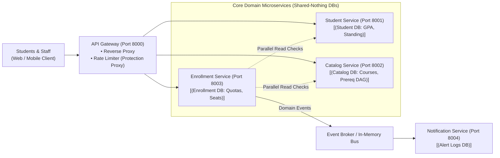
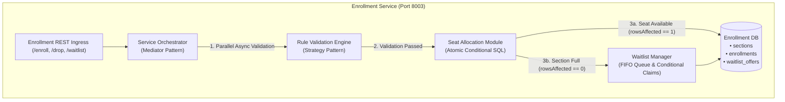
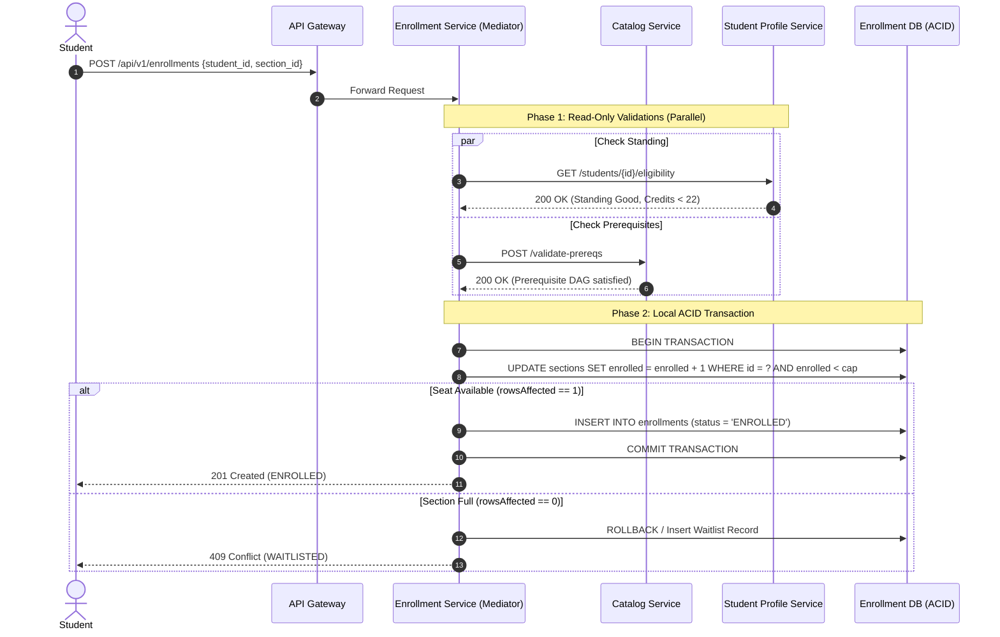
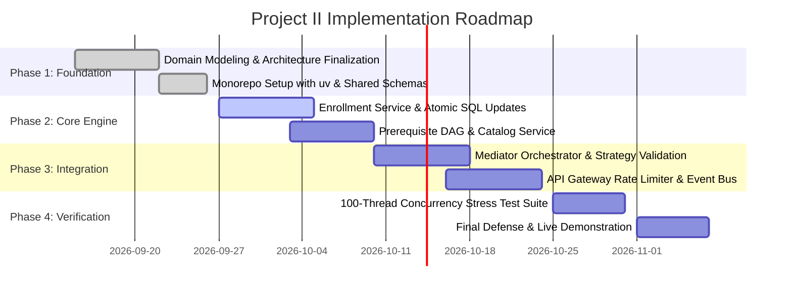

# Student Course Registration System
### Architectural Style Decision & Implementation Strategy
**Software Design and Architecture (13016228) — Project II Progress**

* **Deliverable**: Architectural Style Selection, Trade-Off Analysis & Implementation Blueprint
* **Team**: [Insert Team Members / Student IDs]
* **Target Scenario**: High-Concurrency Academic Course Enrollment (09:00:00 AM Rush)

---

## Agenda

1. **Executive Recap**: The 09:00:00 AM Concurrency Crisis
2. **Core Architectural Characteristics Focus**: Elasticity vs. Scalability, Consistency & Resilience
3. **Architectural Trade-Off & Prioritization Matrix**: Explicit Architectural Trade-offs
4. **Architectural Style Decision**: Evaluation of Candidates (Monolith vs. Choreography vs. Microservices)
5. **Deep Trade-Off Analysis Matrix**: Evaluating Candidates Against Our Focus Characteristics
6. **Architectural Decision Rationale**: Why Database-First Microservices Fits Best
7. **Target System Topology**: Microservices Decomposition & Bounded Contexts
8. **Microservices Ecosystem & Data Boundaries**: Shared-Nothing Relational Stores
9. **Core Engine**: Enrollment Service Internal Structure & Decomposition
10. **Concurrency & Consistency Engine**: Atomic Conditional SQL & Zero-Overbooking
11. **Transaction Boundary & Rollback Safety**: Orchestrated Aggregator vs. Distributed Sagas
12. **Waitlist Lifecycle & TOCTOU Race Prevention**: Safe Atomic Claiming
13. **GoF Design Patterns Portfolio**: Aligning Syllabus Patterns with System Components
14. **Pattern Deep-Dive**: Strategy & Mediator in Formal Python OOP
15. **Technology Stack Selection**: Python 3.11+, Astral `uv`, FastAPI & Async SQLAlchemy
16. **Developer Velocity with Astral `uv`**: Fast Package Management & Deterministic Builds
17. **Implementation & Monorepo Structure**: Modular Codebase Layout
18. **Verification & Concurrency Stress Testing**: 100-Thread Automated Invariant Verification
19. **Project Milestones & Implementation Roadmap**: Gantt Schedule Leading to Final Defense
20. **Summary of Architectural Advantages & Live Demo**: Conclusion & Swagger UI Preview

---

## 1. Executive Recap: The Concurrency Crisis

* **The Problem Scenario**: University registration windows open at scheduled seconds (e.g., 09:00:00 AM), triggering sudden burst traffic from thousands of students.
* **Failure Modes in Traditional Systems**:
  * **Connection Pool Starvation**: Massive concurrent connections exhaust database connection pools, crashing backend web servers.
  * **Phantom Overbooking (Race Conditions)**: Concurrent threads check `enrolled < capacity`, both see available seats, and both enroll, exceeding physical room limits.
  * **Late-Stage Validation Aborts**: Students discover prerequisite or credit clashes *after* checkout, losing opportunities to pick alternative sections.
  * **Coupled Failure Domains**: A bottleneck in transcript generation or course catalog searching brings down the entire enrollment gateway.

---

## 2. Core Architectural Characteristics Focus

In tertiary course registration, general scalability alone is insufficient. We formally distinguish:

* **Elasticity vs. Scalability**:
  * **Elasticity (Primary Focus)**: The ability to **instantaneously absorb sudden, extreme, short-lived spikes/bursts** at 09:00:00 AM without connection pool exhaustion, and immediately de-allocate resources once the rush subsides.
  * **Scalability**: The capacity to handle sustained growth in student body and course offerings across academic semesters.

* **Our 4 Core Architectural Characteristics**:
  1. **Strict Data Consistency & Invariant Preservation (Top Priority)**: Guaranteeing `enrolled_count <= capacity` at all times. Zero overbooking under heavy multi-threaded contention.
  2. **Elasticity & Concurrency Handling**: Sustaining 1,000+ simultaneous checkouts at window opening without server timeouts.
  3. **Fault Tolerance & Blast Radius Isolation (Resilience)**: Secondary outages (notifications, transcripts) never degrade or crash the active enrollment engine.
  4. **Performance & Low Latency**: Sub-second round-trip checkout ($< 500\text{ms}$) to prevent student panic and duplicate click storms.

*(Supporting Structural Characteristic: **Modularity & Extensibility** via pluggable GoF Strategy and Mediator patterns).*

---

## 3. Architectural Characteristics Prioritization & Trade-Offs

No architecture can maximize all characteristics simultaneously. We establish explicit trade-offs:

| Priority Rank | Architectural Characteristic | System Component | Architectural Strategy & Trade-Off Decision |
|---|---|---|---|
| **1 (Highest)** | **Strict Consistency** | Enrollment DB | **Non-Negotiable**: Row-level serializable update for quotas. Overbooking cannot be tolerated. |
| **2** | **Elasticity** | API Gateway & Enrollment | **Decoupled Scaling**: Asymmetric read/write scaling buffers 09:00 AM rush independently. |
| **3** | **Fault Tolerance** | Microservice Ecosystem | **Blast Radius Containment**: Catalog/Notification failures never block seat checkout. |
| **4** | **Performance & Latency** | Orchestrator & Fast-Path | **Asynchronous Concurrency**: `asyncio.gather` for parallel reads + single-trip atomic SQL update. |
| **5** | **Operational Simplicity** | Monorepo (`uv`) | **Local ACID over Sagas**: Encapsulated write boundary eliminates distributed lock overhead. |

* **The Consistency Trade-Off**: We choose **Strict Consistency** for seat reservations (ACID row locks) but accept **Eventual Consistency** for non-critical side effects (email confirmations).
* **The Simplicity Trade-Off**: We reject complex distributed 2PC/Sagas in favor of a single-database write boundary inside `Enrollment Service`.

---

## 4. Architectural Style Candidates Considered

We formally evaluated three candidate architectural styles against our registration scenario:

| Style Candidate | Architectural Mechanism | Key Characteristic |
|---|---|---|
| **Option A: Layered Monolith** | All domain modules share a single process runtime and single central relational database. | Simple to develop, but single point of failure; write-heavy rush exhausts database locks. |
| **Option B: Pure Event-Driven Choreography** | Fully decoupled services communicating exclusively via asynchronous event brokers (Kafka/RabbitMQ). | Extreme decoupling, but complex eventual consistency; hard to enforce immediate zero-overbooking. |
| **Option C: Database-First Microservices with Orchestrated Aggregator** *(Chosen)* | Shared-nothing databases per service; synchronized read validations via Mediator, encapsulated local ACID transaction for writes. | Asymmetric read/write scaling, blast-radius containment, zero-overbooking backed by local ACID engine. |

---

## 5. Deep Trade-Off Analysis Matrix

Evaluating candidate styles against our focused architectural characteristics:

| Architectural Characteristic | Option A: Layered Monolith | Option B: Pure Choreography | Option C: Orchestrated Microservices *(Selected)* |
|---|---|---|---|
| **Elasticity (09:00 AM Burst)** | ⚠️ Poor (All modules share pool) | ⭐️ Excellent (Queue buffers load) | ⭐️ **High (Catalog & Enrollment scale independently)** |
| **Strict Data Consistency** | ⭐️ Immediate ACID (Global DB) | ⚠️ Eventual (Sagas & rollbacks) | ⭐️ **Immediate ACID (Single Enrollment DB boundary)** |
| **Performance & Latency** | ⚠️ High (Lock contention) | ⚠️ High (Multi-hop async queues) | ⭐️ **Sub-Second (Parallel read-checks + single write)** |
| **Fault Tolerance & Isolation**| ❌ Zero (One bug crashes all) | ⭐️ High (Services fail safely) | ⭐️ **High (Read outages do not corrupt enrollment state)** |
| **Operational Simplicity** | ⭐️ High (Single deployment) | ❌ Low (Distributed tracing, deadlocks)| ⭐️ **Balanced (Deployable via Docker / Monorepo `uv`)** |
| **Zero-Overbooking Safety**| ⚠️ Risky without strict row locks | ⚠️ Difficult (Requires compensations) | ⭐️ **100% Guaranteed via Atomic Conditional SQL** |

---

## 6. Architectural Decision Rationale

### Why We Selected Option C (Database-First Orchestrated Microservices):

1. **Optimized for Elasticity & Asymmetric Traffic**:
   * During registration opening, **Course Catalog** experiences $90\%$ read traffic (students browsing sections).
   * **Enrollment Service** experiences high-write contention on seat counters.
   * Decoupling allows independent caching and replica scaling without database lock interference.
2. **Strict Consistency via Encapsulated ACID Boundary**:
   * Pre-enrollment checks (Prerequisites, GPA, Credit Limits) are **strictly read-only**.
   * Only the **Enrollment Service** mutates seat counts and creates enrollment records.
   * Eliminates the need for complex distributed two-phase commits (2PC) or compensating Sagas!
3. **Resilience & Blast Radius Containment**:
   * An outage or slowdown in the Notification Service or Student History log has **zero impact** on active seat allocations.

---

## 7. High-Level Architecture Topology



---

## 8. Microservices Ecosystem & Bounded Contexts

| Service Name | Port | Bounded Context & Core Responsibility | Data Storage Strategy |
|---|---|---|---|
| **API Gateway** | `8000` | Front-door ingress, reverse proxy routing, JWT authorization, and anti-spam rate limiting. | Stateless / In-Memory token bucket |
| **Student Profile Service** | `8001` | Student identity, academic standing, cumulative GPA, and maximum term credit ceilings ($\le 22$). | Relational DB (Isolated read model) |
| **Course Catalog Service** | `8002` | Course definitions, sections, schedules, room capacities, and Directed Acyclic Graph (DAG) for prerequisites. | Relational DB + In-Memory DAG cache |
| **Enrollment Service** | `8003` | **Core Registration Brain**: Orchestrates checks, executes atomic seat reservation, manages waitlists. | Relational DB (Single ACID Source of Truth) |
| **Notification Service** | `8004` | Asynchronous subscriber: Dispatches confirmation emails and 24-hour waitlist promotion notices. | Append-Only Log DB |

---

## 9. Core Engine: Enrollment Service Internal Structure



---

## 10. Concurrency Control: Zero-Overbooking Engine

### The Problem: Naive Read-Then-Write Race Condition
```text
Thread 1: SELECT enrolled_count (reads 39) -> checks 39 < 40 -> OK
Thread 2: SELECT enrolled_count (reads 39) -> checks 39 < 40 -> OK
Thread 1: UPDATE enrolled_count = 40 (Success)
Thread 2: UPDATE enrolled_count = 41 (OVERBOOKED! Exceeds physical room quota)
```

### Our Solution: Atomic Conditional SQL with Application Branching
```sql
UPDATE sections 
SET enrolled_count = enrolled_count + 1 
WHERE section_id = :sec_id 
  AND enrolled_count < capacity;
```
* **Database Row Lock**: Serializes concurrent row updates at database engine level.
* **`rowsAffected == 1`**: Seat claimed! Enrolls student in the exact same transaction.
* **`rowsAffected == 0`**: Section is full! Application cleanly routes student to Waitlist.

---

## 11. Transaction Boundary & Rollback Safety

### Why Orchestrated Aggregator Eliminates Distributed Sagas:



---

## 12. Waitlist Lifecycle & TOCTOU Race Prevention

* **Waitlist Promotion Flow**:
  1. Student drops a section $\rightarrow$ seat is released.
  2. FIFO queue selects next eligible student and generates a `waitlist_offers` record with 24-hour expiration (`expires_at = NOW() + 24h`).
  3. Student receives alert to claim the reserved seat.
* **Preventing Time-of-Check to Time-of-Use (TOCTOU) Races**:
  ```sql
  UPDATE waitlist_offers
  SET status = 'CLAIMED'
  WHERE id = :offer_id 
    AND status = 'OFFERED' 
    AND expires_at > CURRENT_TIMESTAMP;
  ```
* **Result**: If the student double-clicks or claims at the exact millisecond the 24-hour expiration sweeper executes, only one transaction gets `rowsAffected == 1`. Duplicate seat claims are mathematically impossible.

---

## 13. GoF Design Patterns Alignment Portfolio

Our implementation directly maps formal Gang-of-Four (GoF) design patterns to solve core requirements:

| Pattern | System Component | Architectural Purpose & Course Syllabus Alignment |
|---|---|---|
| **Mediator Pattern** | `EnrollmentOrchestrator` | Centralizes inter-service read validations without direct coupling between `StudentService` and `CatalogService`. |
| **Strategy Pattern** | `RuleValidationEngine` | Encapsulates validation algorithms (`PrereqRule`, `CreditLimitRule`, `ScheduleClashRule`) behind a common interface. |
| **State Pattern** | Enrollment Lifecycle Model | Governs valid state transitions: `STAGED -> OFFERED -> ENROLLED -> WAITLISTED -> DROPPED`. |
| **Protection Proxy** | API Gateway Rate Limiter | Intercepts incoming HTTP requests, enforcing Token Bucket rate limits against registration button spam. |
| **Observer Pattern** | Asynchronous Event Bus | Decouples seat change events (`EnrollmentConfirmed`, `SeatDropped`) from email and notification consumers. |
| **Singleton Pattern** | `AcademicTermContext` | Global, thread-safe configuration provider for current semester bounds and registration priority windows. |

---

## 14. Pattern Deep-Dive: Strategy & Mediator in Python

```python
# Strategy Pattern: Validation Engine
class ValidationStrategy(ABC):
    @abstractmethod
    async def validate(self, student_id: str, section_id: int) -> ValidationResult:
        pass


class PrerequisiteRule(ValidationStrategy): ...


class CreditLimitRule(ValidationStrategy): ...


class RuleValidationEngine:
    def __init__(self, strategies: list[ValidationStrategy]):
        self.strategies = strategies

    async def run_all(self, s_id: str, sec_id: int) -> ValidationResult:
        for strat in self.strategies:
            res = await strat.validate(s_id, sec_id)
            if not res.is_valid:
                return res
        return ValidationResult(is_valid=True)
```
* **Open/Closed Principle (OCP)**: Adding new rules (e.g., Department Major Reserved Quota) requires zero changes to existing validation code!

---

## 15. Technology Stack Selection & Rationale

| Layer | Chosen Technology | Engineering Rationale |
|---|---|---|
| **Language & Runtime** | **Python 3.11+** | Rapid developer velocity, clean OOP abstractions, native async event loop (`asyncio`). |
| **Package & Env Manager** | **Astral `uv`** | Rust-powered package manager; 10–100x faster than pip/poetry, unified workspace, deterministic `uv.lock`. |
| **Web API Framework** | **FastAPI + Uvicorn** | High-performance ASGI framework with automatic OpenAPI documentation (`/docs`) for live defense. |
| **Data Validation & DTOs** | **Pydantic v2** | High-speed Rust-core serialization; strictly typed schemas shared across all services. |
| **ORM & Persistence** | **SQLAlchemy 2.0 (Async)** | Explicit transaction boundary management (`async with session.begin():`) and raw atomic SQL support. |
| **Inter-Service Client** | **HTTPX (Async)** | Non-blocking HTTP client supporting parallel requests (`asyncio.gather()`) inside the Mediator. |
| **Testing & Concurrency** | **pytest + pytest-asyncio** | Automated high-concurrency simulation verifying invariants under burst traffic. |

---

## 16. Developer Velocity with Astral `uv`

### Why `uv` for our Monorepo?
* **Instant Environment Synchronization**: Resolves and installs all 5 service environments in milliseconds.
* **Deterministic `uv.lock`**: Guarantees identical dependencies across all teammates' laptops and presentation devices.
* **Zero Virtualenv Headaches**:
  ```bash
  # Start any service instantly with automatic environment resolution
  uv run uvicorn enrollment_service.main:app --port 8003 --reload
  
  # Run full concurrency test suite in one command
  uv run pytest tests/test_concurrency_stress.py -v
  ```

---

## 17. Monorepo Project Structure

```text
student-registration-system/
├── pyproject.toml                  # Workspace dependencies managed via Astral uv
├── uv.lock                         # Deterministic lockfile across all microservices
├── docker-compose.yml              # Containerized multi-service deployment
├── common/                         # Shared Pydantic DTOs & Domain Events
│   ├── schemas.py                  # StudentDTO, CourseDTO, SectionDTO
│   └── events.py                   # SeatDroppedEvent, WaitlistPromotedEvent
├── api_gateway/                    # Port 8000: Reverse Proxy & Protection Proxy Rate Limiter
├── student_service/                # Port 8001: Student Standing, GPA, Credit Ceilings
├── catalog_service/                # Port 8002: Course Catalog & Prerequisite DAG Graph
├── enrollment_service/             # Port 8003: Core Engine (Mediator, Strategy, Atomic SQL)
├── notification_service/           # Port 8004: Event Bus Consumer & Alert Logs
└── tests/                          # Concurrency load tests & invariant verification
    ├── test_validation_strategy.py # Unit tests for Strategy Pattern
    └── test_concurrency_stress.py  # 100 concurrent requests burst test
```

---

## 18. Automated Concurrency Verification Suite

We developed an automated stress-testing harness using `pytest-asyncio` and `httpx`:

```python
@pytest.mark.asyncio
async def test_concurrent_registration_zero_overbooking():
    TOTAL_STUDENTS = 100
    CAPACITY = 10

    async with httpx.AsyncClient(base_url="http://localhost:8000") as client:
        # Launch 100 simultaneous enrollment requests against Section 101
        tasks = [
            client.post(
                "/api/v1/enrollments",
                json={"student_id": f"STU_{i:03d}", "section_id": 101},
            )
            for i in range(TOTAL_STUDENTS)
        ]
        responses = await asyncio.gather(*tasks)

    enrolled = [r for r in responses if r.status_code == 201]
    waitlisted = [r for r in responses if r.status_code == 409]

    # Strict Invariant Assertions
    assert len(enrolled) == CAPACITY, f"Expected {CAPACITY}, got {len(enrolled)}"
    assert len(waitlisted) == TOTAL_STUDENTS - CAPACITY
    # RESULT: Exactly 10 Enrolled, 90 Waitlisted. ZERO Overbooking!
```

---

## 19. Implementation Roadmap & Milestones



---

## 20. Summary of Architectural Advantages

* **High Elasticity**: Read-heavy Catalog and write-heavy Enrollment scale independently without mutual lock contention.
* **Strict Consistency**: Atomic conditional SQL eliminates phantom overbooking (`enrolled_count <= capacity` invariant strictly preserved).
* **Architectural Cleanliness**: Orchestrated Aggregator provides local ACID transaction boundaries without distributed Saga complexity.
* **Academic Rigor**: Formally implements 6 Gang-of-Four design patterns (Mediator, Strategy, State, Proxy, Observer, Singleton).
* **Modern Developer Velocity**: Powered by Astral `uv`, Python 3.11+, and FastAPI with interactive Swagger UI (`/docs`).

---

# Thank You!
### Questions & Technical Discussion

* **OpenAPI Documentation**: `http://localhost:8000/docs`
* **Test Suite**: `uv run pytest tests/ -v`
* **Repository**: KMITL Software Design and Architecture (13016228)
